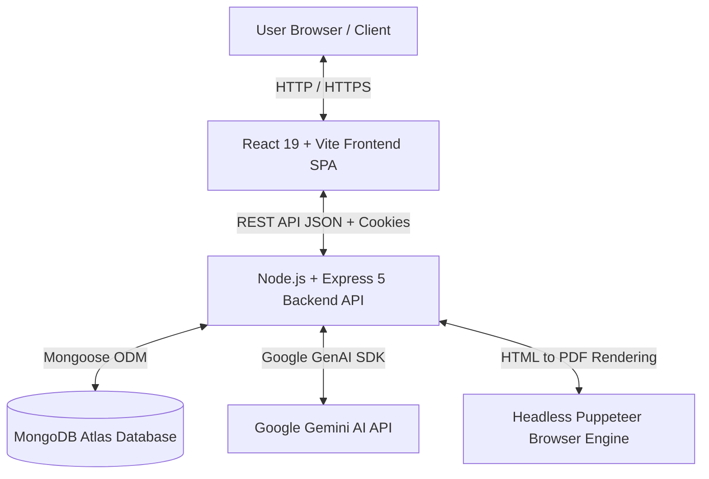
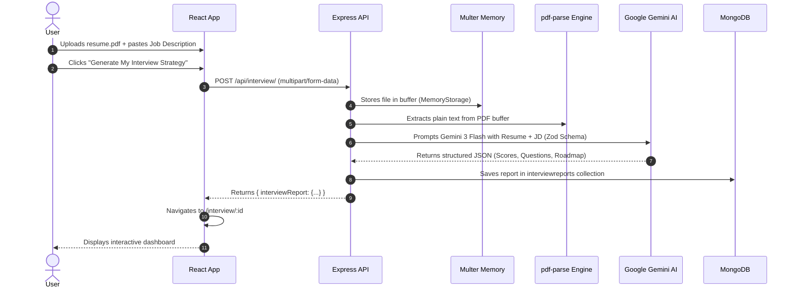
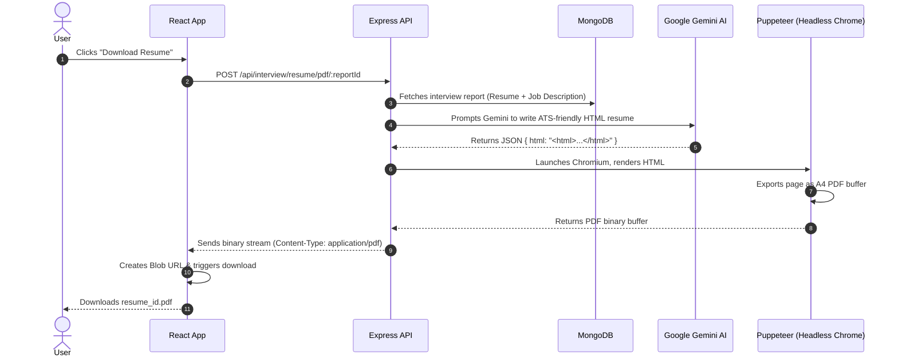

# System Architecture Document - Interview AI

---

## 1. High-Level Architecture Overview

**Interview AI** is built on a modern **Client-Server Architecture** using the MERN stack with external AI and document rendering services.



---

## 2. Frontend Architecture (Client-Side)

The frontend is a single-page application (SPA) built using **React 19** and bundled with **Vite 7**.

### Component Hierarchy & Module Organization
```
Frontend/src/
├── app.routes.jsx            # Central router definition (React Router v7)
├── main.jsx                  # Application root & Context Provider tree
├── features/
│   ├── auth/                 # Authentication domain
│   │   ├── components/       # Protected route wrapper
│   │   ├── context/          # Auth state (user, login, register, logout)
│   │   ├── pages/            # Login.jsx, Register.jsx
│   │   └── services/         # auth.api.js (Axios HTTP requests)
│   └── interview/            # Interview preparation domain
│       ├── context/          # Interview state (report, reports, loading status)
│       ├── hooks/            # useInterview custom hook
│       ├── pages/            # Home.jsx (inputs & history), Interview.jsx (dashboard)
│       └── services/         # interview.api.js (Multipart uploads, PDF download)
└── style/                    # SCSS design system (tokens, buttons, layout, dark theme)
```

### State Management Strategy
- **React Context API**: Used for global domain states (`AuthContext` and `InterviewContext`).
  - `AuthContext`: Tracks currently logged-in user credentials and session authentication status.
  - `InterviewContext`: Manages current interview report data, list of past reports, global loading states, and dynamic status messages.
- **Custom Hook Pattern**: The `useInterview` hook encapsulates API calls, loading indicators, and PDF download triggers, isolating UI components from network logic.

### Routing & Route Protection
- Implemented with **React Router v7**.
- The `<Protected>` component acts as a higher-order wrapper checking whether a user is authenticated:
  - If authenticated $\rightarrow$ renders requested component (`Home` or `Interview`).
  - If not authenticated $\rightarrow$ navigates immediately to `/login`.

---

## 3. Backend Architecture (Server-Side)

The backend is built with **Node.js** and **Express 5**, organized into a **Layered (3-Tier) Architecture**.

```
Backend/src/
├── config/
│   └── database.js           # MongoDB connection lifecycle management
├── models/                   # Data schemas (Mongoose)
│   ├── user.model.js
│   ├── blacklist.model.js
│   └── interviewReport.model.js
├── middlewares/              # Express middlewares
│   ├── auth.middleware.js    # JWT verification & blacklist check
│   └── file.middleware.js    # Multer memory storage configuration
├── controllers/              # Request handling & HTTP response mapping
│   ├── auth.controller.js
│   └── interview.controller.js
├── routes/                   # Endpoint mappings
│   ├── auth.routes.js
│   └── interview.routes.js
├── services/
│   └── ai.service.js         # Google Gemini AI & Puppeteer integration
├── app.js                    # Express app setup, CORS, JSON, Cookie parser
└── server.js                 # Entry point & HTTP server listener
```

### Request Lifecycle
```
Client Request
      │
      ▼
1. CORS & Cookie Middleware (app.js)
      │
      ▼
2. Route Matching (/api/auth or /api/interview)
      │
      ▼
3. Middlewares (auth.middleware.js -> file.middleware.js)
      │
      ▼
4. Controller (Extracts params, validates body/file)
      │
      ▼
5. Service Layer (ai.service.js -> Gemini AI / Puppeteer)
      │
      ▼
6. Model Layer (Mongoose -> MongoDB Atlas)
      │
      ▼
HTTP Response (JSON / PDF Blob to Client)
```

---

## 4. End-to-End Data Flow Diagrams

### 4.1. Report Generation Flow


### 4.2. Tailored Resume PDF Generation Flow


---

## 5. Key Design Patterns & Engineering Highlights

1. **Structured Outputs Pattern (Zod + LLM)**:
   - Instead of receiving unstructured free-form text from the LLM, the backend uses **Zod schemas** converted to JSON schemas (`zod-to-json-schema`).
   - Forces the AI model to guarantee the shape of `matchScore`, `technicalQuestions`, `behavioralQuestions`, `skillGaps`, and `preparationPlan`.

2. **Resilience & Retry Pattern**:
   - Google Gemini preview endpoints occasionally experience temporary traffic spikes (`503 Service Unavailable`).
   - The backend features `generateContentWithRetry()` implementing exponential backoff (retrying up to 4 times with progressive delays), ensuring seamless user experience without manual refreshes.

3. **In-Memory File Processing**:
   - Resumes are stored in RAM buffers via `multer.memoryStorage()` and parsed immediately with `pdf-parse`.
   - Avoids writing sensitive personal PDF files to the server's disk, protecting privacy and preventing disk accumulation.

4. **Resource Isolation with Puppeteer**:
   - Puppeteer's Chromium browser runs inside a `try ... finally` block, guaranteeing that browser processes terminate and release RAM even if HTML rendering encounters an error.
