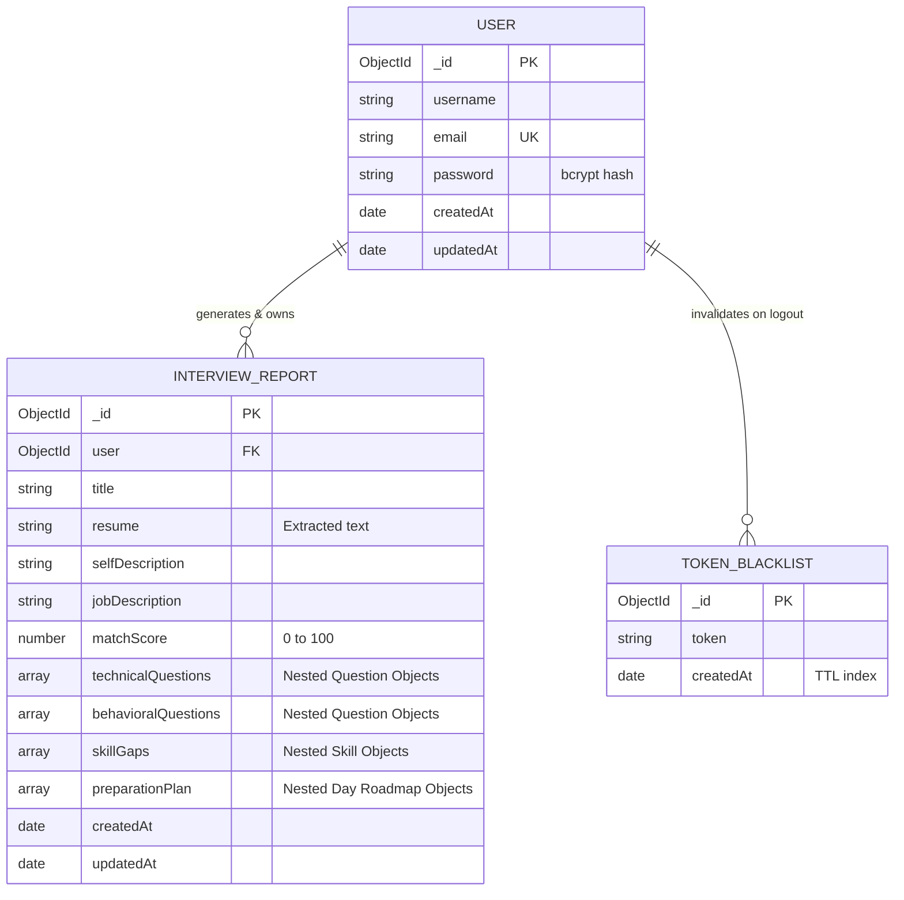

# Database Design Document - Interview AI

---

## 1. Database Overview & Technology Choice

**Interview AI** uses **MongoDB** hosted on **MongoDB Atlas**, accessed through **Mongoose ODM** (Object Data Modeling) in Node.js.

### Why MongoDB?
1. **Document-Oriented Architecture**:
   - An interview report is deeply hierarchical: it contains arrays of technical questions, behavioral questions, skill gap objects, and day-by-day roadmap objects.
   - In a relational SQL database, this would require 5+ separate tables and multiple expensive `JOIN` operations. In MongoDB, the entire report is stored as a single, self-contained JSON-like document.
2. **Schema Flexibility**:
   - AI-generated content can vary in length (e.g., 5 questions vs. 8 questions; 3-day roadmap vs. 7-day roadmap). MongoDB accommodates this naturally.
3. **Cloud Native & Managed**:
   - MongoDB Atlas provides automated backups, high availability, and built-in connection pooling.

---

## 2. Entity Relationship (ER) Model



---

## 3. Collections & Schema Specifications

### 3.1. Collection: `users`
Managed by [`user.model.js`](file:///g:/Resume-Generation/interview-ai-yt/Backend/src/models/user.model.js). Stores user credentials and profile metadata.

| Field Name | BSON Type | Constraints & Flags | Description |
| :--- | :--- | :--- | :--- |
| `_id` | ObjectId | Primary Key, Auto-generated | Unique identifier for each user. |
| `username` | String | `unique: true`, Required | Public display name of the user. |
| `email` | String | `unique: true`, Required | User email address used for login. |
| `password` | String | Required | Salted hash of the user password generated via `bcryptjs`. |
| `createdAt` | Date | Auto-generated (`timestamps: true`) | Account creation timestamp. |
| `updatedAt` | Date | Auto-generated (`timestamps: true`) | Last account update timestamp. |

#### Indexes
- `{ email: 1 }` (Unique): Ensures no duplicate accounts can register with the same email.
- `{ username: 1 }` (Unique): Prevents username conflicts.

---

### 3.2. Collection: `blacklists`
Managed by [`blacklist.model.js`](file:///g:/Resume-Generation/interview-ai-yt/Backend/src/models/blacklist.model.js). Stores invalidated JWT tokens upon logout to prevent token reuse.

| Field Name | BSON Type | Constraints & Flags | Description |
| :--- | :--- | :--- | :--- |
| `_id` | ObjectId | Primary Key, Auto-generated | Unique document ID. |
| `token` | String | Required | The raw JWT string that has been invalidated. |
| `createdAt` | Date | Default: `Date.now` | Timestamp when the user logged out. |

#### Indexing Strategy (TTL Index)
- Can be configured with MongoDB's **Time-To-Live (TTL)** index:
  ```javascript
  tokenBlacklistSchema.index({ createdAt: 1 }, { expireAfterSeconds: 86400 }); // 24 hours
  ```
  *Benefit*: Automatically purges expired tokens from the database once the JWT's natural 1-day validity expires, preventing collection bloat.

---

### 3.3. Collection: `interviewreports`
Managed by [`interviewReport.model.js`](file:///g:/Resume-Generation/interview-ai-yt/Backend/src/models/interviewReport.model.js). Stores the full AI-generated interview plan, questions, and roadmaps.

| Field Name | BSON Type | Constraints & Flags | Description |
| :--- | :--- | :--- | :--- |
| `_id` | ObjectId | Primary Key, Auto-generated | Unique report ID. |
| `user` | ObjectId | `ref: "User"`, Required | Foreign Key referencing the user who owns this report. |
| `title` | String | Optional (AI generated) | Role title extracted from Job Description (e.g. "Senior React Developer"). |
| `resume` | String | Optional | Extracted plain-text content of candidate's PDF resume. |
| `selfDescription`| String | Optional | Text description provided by candidate. |
| `jobDescription` | String | Required | Full text of the target job description. |
| `matchScore` | Number | `min: 0, max: 100`, Required | Role match percentage evaluated by Gemini AI. |
| `technicalQuestions`| Array of Subdocuments | Required | List of technical questions, interviewer intention, and answer. |
| `behavioralQuestions`| Array of Subdocuments | Required | List of behavioral questions, interviewer intention, and answer. |
| `skillGaps` | Array of Subdocuments | Required | List of missing skills and severity levels (`low`, `medium`, `high`). |
| `preparationPlan` | Array of Subdocuments | Required | Day-by-day roadmap with day number, focus area, and task array. |
| `createdAt` | Date | Auto-generated (`timestamps: true`) | Creation timestamp. |
| `updatedAt` | Date | Auto-generated (`timestamps: true`) | Last modification timestamp. |

#### Subdocument Structures

##### Question Subdocument (`technicalQuestions` & `behavioralQuestions`)
```javascript
{
  question: String,   // The question to ask
  intention: String,  // Why the interviewer asks this
  answer: String      // Model answer / talking points
}
```

##### Skill Gap Subdocument (`skillGaps`)
```javascript
{
  skill: String,                          // e.g., "Docker & Kubernetes"
  severity: { type: String, enum: ["low", "medium", "high"] }
}
```

##### Roadmap Day Subdocument (`preparationPlan`)
```javascript
{
  day: Number,         // e.g., 1, 2, 3
  focus: String,       // e.g., "System Design & Scalability"
  tasks: [ String ]    // e.g., ["Read DynamoDB whitepaper", "Design TinyURL"]
}
```

---

## 4. Query Optimization & Projection

When fetching the list of recent interview plans on the home screen, fetching the full resume text and large question arrays would waste bandwidth and slow page loads.

In [`interview.controller.js`](file:///g:/Resume-Generation/interview-ai-yt/Backend/src/controllers/interview.controller.js#L63):
```javascript
const interviewReports = await interviewReportModel.find({ user: req.user.id })
    .sort({ createdAt: -1 })
    .select("-resume -selfDescription -jobDescription -__v -technicalQuestions -behavioralQuestions -skillGaps -preparationPlan");
```
- **Projection (`select`)**: Excludes heavy text and subdocument arrays, returning lightweight card summaries (`_id`, `title`, `matchScore`, `createdAt`).
- **Sorting**: Indexed by `createdAt: -1` to show the most recent plan first.
